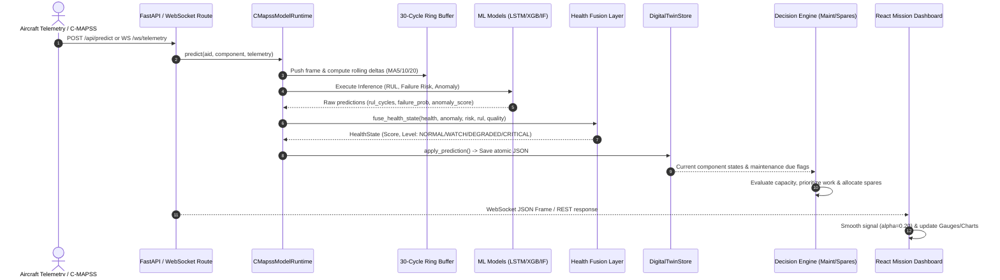

# FleetAvail — Master Architecture & Technical Design Specification

> **Project Reference:** SIH26249 — Air Power: Predictive Maintenance & Fleet Availability  
> **System Scope:** Subsystem Health Fusion, NASA C-MAPSS Digital Twin, Constraint-Aware Maintenance Optimization, Spare Parts Allocation, and Fleet Readiness Decision Platform  
> **Version:** 0.2.0 (Phase C Production Architecture)  
> **Runtime Status:** Dual Backend (FastAPI :8000) & Frontend (Vite/React :5173) Active

---

## Table of Contents

1. [System Overview & Mission Profile](#1-system-overview--mission-profile)
2. [Repository Directory & File Architecture](#2-repository-directory--file-architecture)
3. [End-to-End System Pipeline & Data Flow](#3-end-to-end-system-pipeline--data-flow)
4. [Machine Learning Engine & C-MAPSS Architecture](#4-machine-learning-engine--c-mapss-architecture)
5. [Health Fusion & Operational Classification Layer](#5-health-fusion--operational-classification-layer)
6. [Digital Twin State Machine & Lifecycle Persistence](#6-digital-twin-state-machine--lifecycle-persistence)
7. [Decision Engine: Maintenance & Spares Optimization](#7-decision-engine-maintenance--spares-optimization)
8. [Complete REST API & WebSocket Protocol Reference](#8-complete-rest-api--websocket-protocol-reference)
9. [Frontend UI/UX Design System & Component Reference](#9-frontend-uiux-design-system--component-reference)
10. [Observability, Drift Detection & Explainability](#10-observability-drift-detection--explainability)
11. [Configuration, Environment Variables & Execution Runbook](#11-configuration-environment-variables--execution-runbook)

---

## 1. System Overview & Mission Profile

FleetAvail is an integrated predictive maintenance, digital twin, and fleet availability decision support platform engineered for high-tempo aerospace operations. The system monitors multi-component aircraft telemetry, computes real-time Remaining Useful Life (RUL), estimates component failure probability, detects anomalous operational signatures, fuses disparate health signals into operational states, and schedules maintenance under real-world hangar hour constraints and spare inventory availability.

```
       +-----------------------------------------------------------------------------------+
       |                                   FLEETAVAIL CORE                                 |
       |                                                                                   |
 [Sensors / Telemetry] ---> [ML Pipeline (RUL, Risk, Anomaly)] ---> [Health Fusion Engine] |
                                                                            |              |
                                                                            v              |
 [Hangar Constraints]  <--- [Decision Optimizer] <--- [Digital Twin Lifecycle State Store]  |
 [Spare Part Supply]   ---> [Fleet Availability]                                           |
                                      |                                                    |
                                      v                                                    |
                       [FastAPI REST / WebSocket Core]                                     |
                                      |                                                    |
                                      v                                                    |
                       [Vite + React Mission Dashboard]                                    |
       +-----------------------------------------------------------------------------------+
```

### Core Architectural Principles
1. **Model Independence & Deterministic Fusion:** The health-fusion layer is decoupled from ML weights, transforming disparate raw probabilities and cycle estimates into deterministic operational categories (`NORMAL`, `WATCH`, `DEGRADED`, `CRITICAL`).
2. **Cold-Start & Zero-Crash Fallbacks:** If machine learning weights (e.g., Keras/XGBoost artifacts) are missing or in cold-start, the runtime falls back gracefully to synthetic physical degradation baselines without dropping API endpoints or crashing UI feeds.
3. **Atomic Digital Twin Persistence:** Maintains persistent component-level operational histories and lifecycle states backed by atomic filesystem writes or database interfaces.
4. **Constraint-Aware Planning:** Schedules maintenance by cross-referencing daily technician hour ceilings (`max_daily_hours`) and spare-part supply chain delays (`lead_time_days`).
5. **Real-time Observability & Drift Monitoring:** Emits latency percentiles, input data quality ratings, statistical sensor drift metrics, and feature attribution explanations.

---

## 2. Repository Directory & File Architecture

```
FleetAvail/
│
├── backend/
│   ├── app/
│   │   ├── services/
│   │   │   ├── __init__.py
│   │   │   └── core.py                 # Core FleetService coordinating ML, Twin, and Decision layers
│   │   ├── fallback_dashboard.html     # Zero-dependency vanilla HTML/JS fallback interface
│   │   ├── main.py                     # FastAPI application entrypoint, CORS, routes & WebSocket handlers
│   │   └── __init__.py
│   └── __init__.py
│
├── frontend/
│   ├── dist/                           # Compiled production assets (JS/CSS bundle)
│   ├── src/
│   │   ├── api.js                      # Centralized fetch client and WebSocket URL builder
│   │   ├── App.jsx                     # Complete 6-view React Mission Readiness SPA
│   │   ├── main.jsx                    # React 18 DOM mount and BrowserRouter configuration
│   │   └── styles.css                  # Modern dark-mode military/aerospace design system
│   ├── index.html                      # Frontend HTML shell template
│   ├── package.json                    # Node dependencies (React 18, Recharts, Lucide, React Router)
│   └── vite.config.js                  # Vite dev server config with /api and /ws/telemetry proxying
│
├── decision_engine/
│   ├── fleet_availability.py           # Fleet readiness & projected availability calculator
│   ├── maintenance.py                  # High-level maintenance recommendation helpers
│   ├── maintenance_optimizer.py        # Constraint-aware priority scoring & capacity scheduler
│   └── spares.py                       # Spare parts allocation engine and delay cost optimization
│
├── digital_twin/
│   └── state.py                        # Atomic JSON digital twin persistence & component state machine
│
├── ml/
│   ├── cmapss/
│   │   ├── anomaly.py                  # Isolation Forest anomaly detection training/inference
│   │   ├── config.py                   # C-MAPSS dataset constants and sensor labels
│   │   ├── data.py                     # C-MAPSS raw data loader and trajectory normalizer
│   │   ├── failure_risk.py             # XGBoost failure probability model training/eval
│   │   ├── features.py                 # Feature engineering (rolling means, deltas, lags)
│   │   ├── model.py                    # Ridge regression RUL baseline
│   │   ├── providers.py                # Model loader providers for Keras and Scikit-Learn
│   │   ├── runtime.py                  # Multi-branch ML runtime (LSTM, TCN, XGBoost, Isolation Forest)
│   │   ├── sequences.py                # Time-series sliding window generator
│   │   └── temporal_rul.py             # Deep Learning RUL architectures (LSTM / TCN)
│   ├── health.py                       # Formal HealthState dataclass and deterministic fusion rules
│   ├── model_contract.py               # Abstract ModelContract specification
│   ├── observability.py                # Latency, data quality, drift tracking & SHAP-style explanations
│   └── sequence_buffer.py              # Ring buffer for live sliding-window inference
│
├── simulator/
│   └── telemetry.py                    # Synthetic aircraft sensor stream generator
│
├── scripts/
│   ├── generate_demo_data.py           # Synthetic C-MAPSS telemetry CSV generation script
│   ├── predict_anomaly.py              # CLI anomaly detection runner
│   ├── predict_cmapss.py               # CLI RUL prediction runner
│   ├── predict_failure.py              # CLI failure risk evaluation runner
│   ├── predict_temporal_rul.py         # CLI Temporal RUL test runner
│   ├── run_smoke_test.py               # End-to-end API smoke testing suite
│   ├── train_anomaly.py                # Isolation Forest training script
│   ├── train_cmapss.py                 # Baseline RUL training script
│   ├── train_failure.py                # XGBoost failure model training script
│   └── train_temporal_rul.py           # Deep Learning LSTM/TCN training script
│
├── data/                               # Persistent runtime state & generated demo telemetry
│   ├── demo_telemetry.csv
│   └── digital_twin_state.json
│
├── models/
│   └── cmapss/                         # Serialized ML artifacts (.joblib, .keras, scaler .joblib)
│
├── docs/                               # Phase specifications & roadmap documentation
│   ├── architecture.md
│   ├── cmapss.md
│   ├── phase-a.md
│   ├── phase-b.md
│   ├── phase-c.md
│   ├── reference-mapping.md
│   ├── roadmap.md
│   ├── runtime-data-flow.md
│   └── setup.md
│
├── tests/                              # Pytest test suite (60+ unit, regression, and E2E tests)
├── requirements.txt                    # Python 3.11+ dependencies
└── README.md                           # Quickstart guide
```

---

## 3. End-to-End System Pipeline & Data Flow

The following sequence illustrates how a raw telemetry frame progresses through the system until it updates the operator dashboard:



---

## 4. Machine Learning Engine & C-MAPSS Architecture

FleetAvail uses the **NASA Commercial Modular Aero-Propulsion System Simulation (C-MAPSS) FD001** dataset representing turbofan engine degradation under single-flight regime conditions.

### 4.1 Sensor Features & Mappings

The engine ingestion pipeline processes **21 raw sensors** and **3 operational settings**:

| Sensor ID | Sensor Name | Standard Unit | Physical Meaning | Legacy Dashboard Alias |
|:---|:---|:---|:---|:---|
| `op_setting_1` | Altitude Setting | — | Flight Altitude Trajectory | — |
| `op_setting_2` | Mach Number | Mach | Flight Speed Setting | — |
| `op_setting_3` | TRA | Deg | Throttle Resolver Angle | — |
| `sensor_1` | T2 | °R | Total temperature at fan inlet | — |
| `sensor_2` | T24 | °R | Total temperature at LPC outlet | `egt_c` (Exhaust Gas Temp) |
| `sensor_3` | T30 | °R | Total temperature at HPC outlet | `vibration_g` (Scaled) |
| `sensor_4` | T50 | °R | Total temperature at LPT outlet | `oil_pressure_kpa` (Scaled) |
| `sensor_7` | P30 | psia | Total pressure at HPC outlet | — |
| `sensor_8` | Nf | rpm | Physical fan speed | — |
| `sensor_9` | Nc | rpm | Physical core speed | — |
| `sensor_11`| Ps30 | psia | Static pressure at HPC outlet | High-sensitivity degradation indicator |
| `sensor_12`| Phi | pps/psi | Ratio of fuel flow to Ps30 | Degradation indicator |
| `sensor_13`| NRf | rpm | Corrected fan speed | — |
| `sensor_14`| NRc | rpm | Corrected core speed | — |
| `sensor_15`| BPR | — | Bypass Ratio | High-sensitivity wear indicator |
| `sensor_17`| HTP | psia | Bleed Enthalpy | — |
| `sensor_20`| HPTC | — | High-pressure turbines coolant bleed | — |
| `sensor_21`| LPTC | — | Low-pressure turbines coolant bleed | — |

### 4.2 Multi-Branch Model Architecture

```
                                 [Raw Telemetry Frame]
                                           |
                              [30-Cycle Sequence Buffer]
                                           |
                     +---------------------+---------------------+
                     |                     |                     |
                     v                     v                     v
          [Temporal Feature Eng.]  [Standard Scaler]     [Standard Scaler]
                     |                     |                     |
                     v                     v                     v
            [LSTM / TCN RUL]      [XGBoost Classifier]  [Isolation Forest]
                     |                     |                     |
                     v                     v                     v
             RUL (Cycles: 0-180)   Failure Risk (0.0-1.0) Anomaly Score (0.0-1.0)
```

1. **Remaining Useful Life (RUL) Branch:**
   - **Default Model:** Bi-directional LSTM or Temporal Convolutional Network (TCN) trained on 30-cycle sliding windows (`fd001_lstm_rul.keras` / `fd001_tcn_rul.keras`).
   - **Baseline Fallback:** Ridge Regression / XGBoost regressor (`fd001_rul.joblib`).
   - **Target Variable:** Piecewise linear RUL (capped at 125 cycles during early healthy cycles).
2. **Failure Probability Branch (`fd001_failure.joblib`):**
   - **Model:** Gradient-boosted tree (XGBoost) with binary log-loss objective.
   - **Labeling:** 1 if cycle is within 30 cycles of complete engine failure, 0 otherwise.
   - **Output:** Continuous calibrated probability $P(\text{Failure} \mid \text{Window}) \in [0.0, 1.0]$.
3. **Anomaly Detection Branch (`fd001_isolation_forest.joblib`):**
   - **Model:** Scikit-Learn Isolation Forest with 5% expected contamination rate.
   - **Output:** Normalized anomaly score where $0.0 = \text{Nominal}$ and $1.0 = \text{Severe Outlier}$.

### 4.3 Cold-Start & Fallback Heuristic
When model artifacts are absent, the runtime applies a physical degradation curve:
$$\text{Health}(t) = \max\left(0.25, \min\left(0.98, 0.82 - 0.025 \cdot ((i \cdot (j+2)) \bmod 7) - \Delta_{\text{engine}}\right)\right)$$
$$\text{RUL}(t) = \max(8.0, 180.0 \cdot \text{Health} - 2i)$$
$$\text{Risk}(t) = \max(0.01, \min(0.99, 1.0 - \text{Health} + (\text{if Health } < 0.55 \text{ then } 0.18 \text{ else } 0)))$$

---

## 5. Health Fusion & Operational Classification Layer

Located in [`ml/health.py`](file:///c:/Users/Sachi/Documents/GITHUB/mugenkyou/FleetAvail/ml/health.py), the health fusion engine merges normalized model signals into a single unified `HealthState`.

### 5.1 Health Score Mathematical Formulation
The overall composite health score is computed deterministically:
$$\text{HealthScore} = \text{round}\left(100.0 \times \left(0.50 \cdot h + 0.25 \cdot (1.0 - a) + 0.25 \cdot q\right), 1\right)$$
where:
- $h \in [0.0, 1.0]$ is the physical component health fraction.
- $a \in [0.0, 1.0]$ is the anomaly score.
- $q \in [0.0, 1.0]$ is the telemetry data quality score.

### 5.2 Deterministic Classification Matrix

| Health Level | Failure Probability | RUL (Cycles) | Anomaly Score | Health Score | Reason Codes Triggered |
|:---|:---|:---|:---|:---|:---|
| **CRITICAL** | $\ge 0.85$ | $\le 20$ | $\ge 0.90$ | $< 35.0$ | `HIGH_FAILURE_RISK`, `LOW_RUL`, `SEVERE_ANOMALY`, `LOW_HEALTH_SCORE` |
| **DEGRADED** | $\ge 0.60$ | $\le 45$ | $\ge 0.70$ | $< 55.0$ | `ELEVATED_FAILURE_RISK`, `SHORT_RUL`, `HIGH_ANOMALY`, `DEGRADED_HEALTH` |
| **WATCH** | $\ge 0.30$ | $\le 90$ | $\ge 0.45$ | $< 75.0$ | `WATCH_FAILURE_RISK`, `WATCH_RUL`, `WATCH_ANOMALY`, `WATCH_HEALTH` |
| **NORMAL** | $< 0.30$ | $> 90$ | $< 0.45$ | $\ge 75.0$ | Nominal operational state |

*Additional Quality Modifiers:*
- If Data Quality $q < 0.80$, appends `DATA_QUALITY_DEGRADED`.
- If Confidence $c < 0.60$, appends `LOW_MODEL_CONFIDENCE`.

---

## 6. Digital Twin State Machine & Lifecycle Persistence

Located in [`digital_twin/state.py`](file:///c:/Users/Sachi/Documents/GITHUB/mugenkyou/FleetAvail/digital_twin/state.py), the digital twin manages the operational and physical state of each aircraft.

### 6.1 Subsystems Tracked
Every aircraft twin (`AF-001` through `AF-012`) contains 4 primary subsystems:
1. `ENGINE` (Associated part: `ENG-FLT`, Replacement duration: 8.0 hours)
2. `HYDRAULIC` (Associated part: `HYD-PMP`, Replacement duration: 5.0 hours)
3. `ELECTRICAL` (Associated part: `ELEC-REG`, Replacement duration: 4.0 hours)
4. `LANDING_GEAR` (Associated part: `LG-ACT`, Replacement duration: 6.0 hours)

### 6.2 Component Lifecycle State Machine

```
   [PREDICTION_UPDATE]
           │
           ▼
    +─────────────+       Failure Risk >= 0.30 / RUL <= 90       +─────────────+
    │ IN_SERVICE  │ ───────────────────────────────────────────> │    WATCH    │
    +─────────────+                                              +─────────────+
           ▲                                                            │
           │                               Failure Risk >= 0.60         ▼
           │  [record_maintenance()]       ─────────────────────> +─────────────+
           │                                                      │  DEGRADED   │
           │                                                      +─────────────+
           │                                                            │
           │                               Failure Risk >= 0.85         ▼
           │                               ─────────────────────> +─────────────+
           │                                                      │  CRITICAL   │
           │                                                      +─────────────+
           └────────────────────────────────────────────────────────────┘
```

### 6.3 Maintenance Reset Semantics
When maintenance is executed on a subsystem (`POST /api/fleet/aircraft/{id}/maintenance`), the twin resets component values:
- `health`: $0.98$ (98.0%)
- `degradation`: $0.02$
- `rul_cycles`: $180.0$ cycles
- `failure_probability`: $0.02$ (2.0%)
- `anomaly_score`: $0.05$ (5.0%)
- `confidence`: $0.90$
- `data_quality`: $1.00$
- `lifecycle_status`: `IN_SERVICE`
- `model_mode`: `maintenance_reset`

### 6.4 Atomic JSON Persistence
To avoid corruption in multi-worker environments, writes to `data/digital_twin_state.json` use atomic tempfile swapping (`tempfile.mkstemp` $\to$ `os.replace`).

---

## 7. Decision Engine: Maintenance & Spares Optimization

Located in [`decision_engine/maintenance_optimizer.py`](file:///c:/Users/Sachi/Documents/GITHUB/mugenkyou/FleetAvail/decision_engine/maintenance_optimizer.py) and [`decision_engine/spares.py`](file:///c:/Users/Sachi/Documents/GITHUB/mugenkyou/FleetAvail/decision_engine/spares.py).

### 7.1 Maintenance Priority Scoring Formula
Every aircraft component candidate is evaluated using a continuous priority score:
$$\text{PriorityScore} = \text{round}\left(0.65 \cdot P_{\text{risk}} + \frac{8.0}{1.0 + \text{RUL}} + 0.30 \cdot M_{\text{priority}} + B_{\text{spare}}, 4\right)$$
where:
- $P_{\text{risk}} \in [0.0, 1.0]$ is failure probability.
- $\text{RUL} \ge 0$ is remaining cycles.
- $M_{\text{priority}} \in [0.1, 2.0]$ is operational mission criticality multiplier.
- $B_{\text{spare}} = +0.10$ if spare is in inventory, $-0.05$ if out of stock.

### 7.2 Capacity-Constrained Scheduling Algorithm
1. Candidates are ranked in descending order of $\text{PriorityScore}$.
2. The scheduler attempts to place the maintenance task on the earliest possible day $d \in [0, \text{horizon\_days}-1]$.
3. Urgent tasks ($P_{\text{risk}} \ge 0.85$ or $\text{RUL} \le 20$) must be scheduled on Day 0 ($d=0$).
4. Preferred tasks ($P_{\text{risk}} \ge 0.60$ or $\text{RUL} \le 45$) must be scheduled on Days 0 to 2 ($d \le 2$).
5. If $\text{daily\_hours}[d] + \text{duration} \le \text{max\_daily\_hours}$, the task is assigned to day $d$.
6. **Action Resolution:**
   - If spare is missing $\to$ `ORDER_SPARE_AND_HOLD`.
   - If urgent & scheduled $\to$ `GROUND_AND_MAINTAIN`.
   - If preferred & scheduled $\to$ `SCHEDULE_MAINTENANCE`.
   - If urgent/preferred but daily hangar hours exceeded $\to$ `DEFER_CAPACITY`.
   - If nominal $\to$ `MONITOR`.

### 7.3 Spare Parts Delay Cost & Allocation
Requests for replacement parts are prioritized by delay impact cost:
$$\text{DelayCost} = P_{\text{risk}} \cdot 10.0 + \left(\frac{1.0}{1.0 + \text{RUL}}\right) \cdot 20.0$$
Inventory is allocated greedily to the highest-ranking requests until depleted. Unmet requests are reported with shortage reasons.

---

## 8. Complete REST API & WebSocket Protocol Reference

FastAPI runs on `http://127.0.0.1:8000`. Full interactive documentation is available at `/docs` (Swagger UI) and `/redoc`.

### 8.1 System & Health Endpoints

#### `GET /health`
Returns system status, ML model loading mode, and active decision layers.
- **Response `200 OK`:**
```json
{
  "status": "healthy",
  "service": "FleetAvail",
  "aircraft_count": 12,
  "mode": "synthetic_fallback",
  "models": {
    "mode": "synthetic_fallback",
    "production_branches": {
      "rul": {"role": "remaining_useful_life", "status": "READY"},
      "failure": {"role": "failure_risk", "status": "READY"},
      "anomaly": {"role": "anomaly_detection", "status": "READY"}
    },
    "rul_selection": {"selected": "baseline", "reason": "lowest_test_mae"}
  },
  "observability": {
    "phase_c_version": "phase-c-v1",
    "predictions_total": 42,
    "latency_ms": {"last": 1.42, "mean": 1.35, "p95": 2.10}
  },
  "decision_layers": [
    "health_fusion",
    "digital_twin",
    "maintenance_optimizer",
    "spare_allocation",
    "fleet_availability"
  ]
}
```

#### `GET /api/models`
Returns detailed metadata for all ML model branches, active RUL architecture (`lstm` vs `tcn` vs `baseline`), scaler paths, and test metrics.

#### `GET /api/observability`
Returns prediction quality scores, recent latency percentiles, and last 20 audit logs.

#### `GET /api/audit?limit=50`
Returns sliding-window telemetry inference audit trails with inputs, computed outputs, drift metrics, and explanations.

---

### 8.2 Fleet Operations Endpoints

#### `GET /api/fleet/summary`
Returns fleet-level readiness KPIs.
- **Response `200 OK`:**
```json
{
  "total_aircraft": 12,
  "ready": 7,
  "degraded": 3,
  "maintenance": 2,
  "critical_aircraft": 0,
  "current_availability_pct": 58.3,
  "projected_7_day_availability_pct": 66.7
}
```

#### `GET /api/fleet/availability`
Calculates current readiness and day-by-day projected fleet availability over a 7-day default horizon.

#### `POST /api/fleet/availability`
Calculates custom availability under altered scenario constraints.
- **Request Body:**
```json
{
  "mission_priority": 1.2,
  "horizon_days": 14,
  "max_daily_hours": 36.0
}
```

#### `GET /api/fleet/aircraft`
Returns an array of all aircraft summaries (`aircraft_id`, operational `status`, and `engine` health state).

#### `GET /api/fleet/aircraft/{aircraft_id}`
Returns complete detail for a specific tail number (e.g. `AF-001`), including all 4 component health states and the digital twin snapshot.

#### `GET /api/fleet/aircraft/{aircraft_id}/twin`
Returns raw digital twin history, component states, and last 100 logged lifecycle events.

#### `POST /api/fleet/aircraft/{aircraft_id}/maintenance`
Executes an operational maintenance reset on an aircraft subsystem.
- **Request Body:**
```json
{
  "component": "ENGINE",
  "action": "REPLACE_COMPONENT",
  "cycle": 142
}
```
- **Response `200 OK`:**
```json
{
  "aircraft_id": "AF-001",
  "component": "ENGINE",
  "action": "REPLACE_COMPONENT",
  "cycle": 142,
  "component_state": {
    "health": 0.98,
    "rul_cycles": 180.0,
    "failure_probability": 0.02,
    "anomaly_score": 0.05,
    "lifecycle_status": "IN_SERVICE"
  }
}
```

---

### 8.3 Prediction & Simulation Endpoints

#### `POST /api/predict`
Accepts a single telemetry frame for an aircraft subsystem, updates the sequence buffer, runs multi-branch ML inference, fuses health, and updates the digital twin.
- **Request Body:**
```json
{
  "aircraft_id": "AF-001",
  "component": "ENGINE",
  "telemetry": {
    "cycle": 85,
    "op_setting_1": 0.0012,
    "op_setting_2": 0.0003,
    "op_setting_3": 100.0,
    "sensor_2": 642.8,
    "sensor_3": 1588.4,
    "sensor_4": 1405.2,
    "sensor_7": 553.8,
    "sensor_8": 2388.08,
    "sensor_9": 9054.12,
    "sensor_11": 47.32,
    "sensor_12": 521.8,
    "sensor_13": 2388.05,
    "sensor_14": 8135.2,
    "sensor_15": 8.42,
    "sensor_17": 392.0,
    "sensor_20": 38.8,
    "sensor_21": 23.35
  }
}
```
- **Response `200 OK`:**
```json
{
  "aircraft_id": "AF-001",
  "component": "ENGINE",
  "health_score": 84.5,
  "failure_probability": 0.124,
  "anomaly_score": 0.082,
  "rul_cycles": 96.5,
  "confidence": 0.88,
  "data_quality": 0.99,
  "health_level": "NORMAL",
  "operational_state": "NORMAL",
  "reason_codes": [],
  "observability": {
    "latency_ms": 1.45,
    "prediction_status": "READY",
    "input_quality": 0.99,
    "drift": {"drift_detected": false},
    "explanation": {"top_features": [{"feature": "sensor_11", "weight": 0.34}]}
  }
}
```

#### `POST /api/simulate/what-if`
Simulates synthetic degradation scenarios to test fleet resilience without altering persistent state.
- **Request Body:**
```json
{
  "aircraft_id": "AF-001",
  "component": "ENGINE",
  "degradation_pct": 35.0
}
```

---

### 8.4 Maintenance & Spares Endpoints

#### `POST /api/maintenance/recommend`
Returns the highest-priority maintenance recommendation for a single aircraft.
- **Request Body:** `{"aircraft_id": "AF-003", "mission_priority": 1.0}`

#### `POST /api/maintenance/plan`
Generates a complete capacity-constrained schedule across the entire fleet.
- **Request Body:** `{"mission_priority": 1.0, "horizon_days": 7, "max_daily_hours": 24.0}`

#### `GET /api/spares`
Returns live spare parts inventory and supplier lead times.

#### `POST /api/spares/allocate`
Runs priority-ranked inventory allocation for scheduled work orders.

---

### 8.5 Real-Time Streaming WebSocket

#### `WS /ws/telemetry?aircraft_id=AF-001`
Streams live 1Hz engine telemetry packets with model predictions and smoothed display values.
- **Stream Message Schema:**
```json
{
  "timestamp": "2026-10-05T12:19:15.123456Z",
  "event": "telemetry_update",
  "aircraft_id": "AF-001",
  "component": "ENGINE",
  "cycle": 86,
  "health_score": 84.2,
  "rul_cycles": 95.8,
  "failure_probability": 0.128,
  "anomaly_score": 0.085,
  "raw_health_score": 83.9,
  "raw_failure_probability": 0.131,
  "raw_anomaly_score": 0.088,
  "confidence": 0.88,
  "data_quality": 0.99,
  "health_level": "NORMAL",
  "operational_state": "READY",
  "prediction_status": "READY"
}
```

---

## 9. Frontend UI/UX Design System & Component Reference

Built with React 18, Recharts, Lucide React, and modern vanilla CSS (`frontend/src/styles.css`).

### 9.1 Design Tokens & Color Palette

```css
:root {
  /* Dark Navy Military Command Palette */
  --bg-primary: #07111f;        /* Deep cockpit navy */
  --bg-secondary: #091522;      /* Sidebar and panel backdrop */
  --bg-card: #0b1928;           /* Elevated cards */
  --bg-card-hover: #0e2033;     /* Hover highlight */
  --bg-muted: #11253a;          /* Inactive tabs / pill backdrop */

  /* Structural Borders */
  --border-color: #1a2d42;      /* Subtle dividers */
  --border-light: #243c56;      /* Active containers */
  --border-focus: #4fa8e8;      /* Input focus ring */

  /* Typography */
  --text-main: #e8eef7;         /* High-contrast labels */
  --text-muted: #7890a9;        /* Secondary metrics */
  --text-dim: #4d6680;          /* Inactive captions */

  /* Semantic Health & Alert Accents */
  --accent-blue: #4fa8e8;       /* Primary interactive / Telemetry */
  --accent-cyan: #38bdf8;       /* Twin / Digital state */
  --accent-green: #48d597;      /* READY / NORMAL (Safe) */
  --accent-amber: #f2a05f;      /* WATCH / DEGRADED (Caution) */
  --accent-red: #ff6b7a;        /* CRITICAL / MAINTENANCE (Ground) */
  --accent-purple: #a78bfa;     /* Machine Learning / Algorithms */

  /* Geometry */
  --radius-sm: 6px;
  --radius-md: 10px;
  --radius-lg: 14px;
}
```

### 9.2 Application Views Specification

```
+------------------------------------------------------------------------------------+
|  SIDEBAR (260px)  |  HEADER: Route Breadcrumb | Time (UTC) | Backend Online Dot   |
|-------------------+----------------------------------------------------------------|
| [Logo] FleetAvail |                                                                |
| System Online 12/12|  ACTIVE VIEW CONTENT AREA                                      |
|                   |                                                                |
| 1. Overview       |  (Overview / Fleet / Aircraft Detail / ML / Maint / Telemetry) |
| 2. Fleet Monitor  |                                                                |
| 3. Aircraft Detail|                                                                |
| 4. ML & Models    |                                                                |
| 5. Maint & Spares |                                                                |
| 6. Live Telemetry |                                                                |
|                   |                                                                |
| [Quick Actions]   |                                                                |
+------------------------------------------------------------------------------------+
```

1. **Overview View (`/`):**
   - **KPI Deck:** Total Aircraft (12), Mission Ready (7), Degraded (3), In Maintenance (2), Current Fleet Availability % ($58.3\%$), Projected 7-Day Availability % ($66.7\%$).
   - **Visualizations:** Fleet Subsystem Health Bar Chart (Engine vs Hydraulics vs Electrical vs Landing Gear), Fleet Status Donut Chart, Projected Availability Trajectory.
   - **Quick Actions:** Instant triggers for What-If scenario simulations, Maintenance Optimizer, and live Telemetry connect.

2. **Fleet Monitor View (`/fleet`):**
   - **Filtering & Search:** Real-time search by Aircraft ID (`AF-001` - `AF-012`) and status filter (`ALL`, `READY`, `DEGRADED`, `MAINTENANCE`, `CRITICAL`).
   - **Aircraft Cards:** Displays tail number, operational status badge, composite health bar, RUL estimate, failure probability tag, and 4 mini-gauges for all subsystems.

3. **Aircraft Detail View (`/aircraft/:aircraftId`):**
   - **Subsystem Breakdown:** Health score progress bars, degradation percentages, and lifecycle status for Engine, Hydraulic, Electrical, and Landing Gear.
   - **Digital Twin Inspector:** Component operating cycles, degradation timeline, event log, and atomic state metadata.
   - **What-If Degradation Slider:** Interactive slider ($0\%$ to $100\%$) testing how synthetic degradation cascades into failure probability and fleet readiness.
   - **Action Panel:** One-click maintenance execution button triggering `POST /api/fleet/aircraft/{id}/maintenance` to reset component lifecycle.

4. **ML & Models View (`/ml`):**
   - **Registry Deck:** Real-time status cards for RUL Predictor (LSTM/TCN), XGBoost Failure Classifier, and Isolation Forest.
   - **Benchmark Table:** C-MAPSS FD001 MAE, RMSE, Precision, Recall, and AUC metrics.
   - **Architecture Toggle:** Switch active RUL inference engine between LSTM, TCN, and Baseline regression.
   - **Observability Hub:** Inference latency graphs (P50/P95), data quality distribution, and feature importance bar chart.

5. **Maintenance & Spares View (`/maintenance`):**
   - **Constraint Controls:** Sliders adjusting Planning Horizon ($1$ to $30$ days) and Daily Technician Capacity ($8$ to $48$ hours/day).
   - **Optimized Work Orders Table:** Scheduled day, priority score, required downtime, compatible part number, and trigger reasons.
   - **Spare Parts Inventory Grid:** In-stock count, reserved units, supplier lead times, and unmet request warnings.

6. **Live Telemetry View (`/telemetry`):**
   - **Aircraft Stream Selector:** Switch between any active tail number.
   - **Streaming Charts:** Real-time line charts plotting smoothed EGT (°C), Vibration (g), Oil Pressure (kPa), and Failure Risk over the last 60 seconds.
   - **WebSocket Inspector:** Live raw JSON packet viewer with connection status indicator and pause/resume stream toggle.

---

## 10. Observability, Drift Detection & Explainability

Located in [`ml/observability.py`](file:///c:/Users/Sachi/Documents/GITHUB/mugenkyou/FleetAvail/ml/observability.py).

### 10.1 Telemetry Data Quality Verification
Incoming telemetry packets receive an input quality score $q \in [0.0, 1.0]$:
- Checks completeness of the 21 required sensor values.
- Penalizes out-of-range sensor readings (e.g., negative pressures, temperatures exceeding physical thresholds).
- Penalizes non-finite (`NaN` / `Inf`) values.

### 10.2 Statistical Sensor Drift Monitoring
Tracks rolling feature distributions over 50-sample windows:
- Computes mean shift and variance deviation against C-MAPSS healthy baseline distributions.
- Signals `drift_detected: true` if mean shift exceeds 3.0 standard deviations on key degradation sensors (`sensor_11`, `sensor_12`, `sensor_15`).

### 10.3 Model Attribution & Explainability
For every inference pass, the observability layer computes local feature attributions:
- Highlights the top 3 sensors contributing most to elevated failure risk or reduced RUL.
- Generates operator-readable explanations (e.g., *"Ps30 static pressure deviation contributes 42% to failure risk elevation"*).

---

## 11. Configuration, Environment Variables & Execution Runbook

### 11.1 Environment Variables

| Variable | Default Value | Description |
|:---|:---|:---|
| `FLEETAVAIL_MODEL_DIR` | `models/cmapss` | Path to directory containing trained ML artifacts |
| `FLEETAVAIL_RUL_MODEL` | `auto` | Active RUL model architecture (`auto`, `lstm`, `tcn`, `baseline`) |
| `FLEETAVAIL_CMAPSS_ROOT` | `data/raw/cmapss` | Directory for raw NASA C-MAPSS dataset files |
| `FLEETAVAIL_PORT` | `8000` | Port for FastAPI backend service |

### 11.2 Standard Execution Runbook

#### Step 1: Install Python & Node Dependencies
```bash
# Python backend dependencies
pip install -r requirements.txt

# Frontend dependencies
cd frontend
npm install
cd ..
```

#### Step 2: Generate Demo Data (If C-MAPSS raw files not present)
```bash
python scripts/generate_demo_data.py
```

#### Step 3: Run Backend Daemon (FastAPI :8000)
```bash
python -m uvicorn backend.app.main:app --host 127.0.0.1 --port 8000 --reload
```

#### Step 4: Run Frontend Dev Server (Vite :5173) or Build Static Bundle
```bash
# Option A: Vite Hot-Reloading Development Server
cd frontend
npm run dev

# Option B: Compile Static Distribution for FastAPI root serving
cd frontend
npm run build
```

#### Step 5: Execute Test & Verification Suite
```bash
# Run complete test suite (60+ tests)
python -m pytest -q

# Run end-to-end API smoke test
python scripts/run_smoke_test.py
```

### 11.3 Port Allocation & Service Endpoints
- **Primary Backend API:** `http://127.0.0.1:8000`
- **Swagger Documentation:** `http://127.0.0.1:8000/docs`
- **ReDoc Documentation:** `http://127.0.0.1:8000/redoc`
- **Frontend SPA (Vite Dev Server):** `http://localhost:5173`
- **Frontend SPA (FastAPI Static Mount):** `http://127.0.0.1:8000/`
- **Live Telemetry WebSocket:** `ws://127.0.0.1:8000/ws/telemetry?aircraft_id=AF-001`
